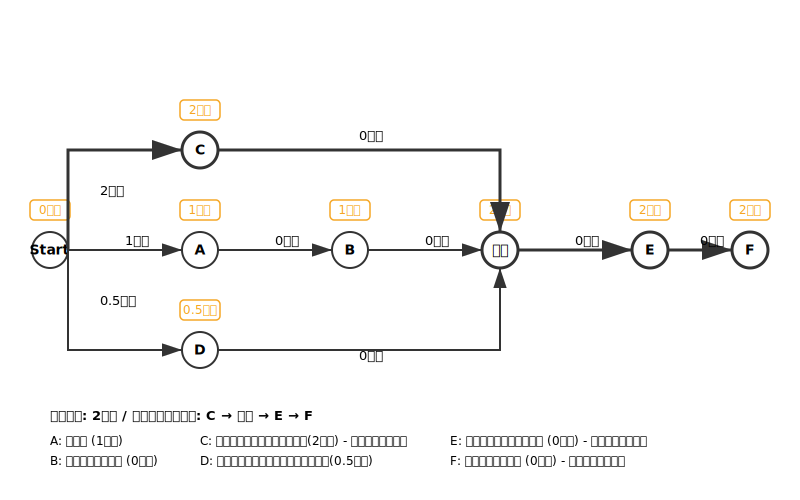

## 計画概要（背景の統合）

### プロジェクト背景
- **期限**: 10/31までに
- **目的**: 11/1に出前寿司を提供するプロジェクトを開始したい
- **成果物**: 色々な場面を想定した出前寿司セットを提供するための計画（調達、調理）を立てて欲しい
- **範囲**: 計画書のみ

本計画は、`task.csv` の作業分解に基づき、依存関係と所要時間を解析した上でPERT図（Mermaid, AOA）を生成し、クリティカルパスを明示します。所要時間が未記入のタスク（B, E, F）については、入力データに基づき図示上は0時間として扱います。

### 対象タスクと時間（時間）
- **A: 米炊き** — 1時間
- **B: 料理酢混ぜ合わせ** — 0時間（入力未記載のため0扱い）
- **C: 魚を捌く（サーモン・いか）** — 2時間
- **D: 野菜、卵の加工（きゅうり・ねぎ）** — 0.5時間
- **E: 材料合わせ、パック詰め** — 0時間（入力未記載のため0扱い）
- **F: 個包装調味料添付** — 0時間（入力未記載のため0扱い）

### 依存関係
- **B** は **A** 完了後
- **E** は **B, C, D** 完了後
- **F** は **E** 完了後

### クリティカルパスの考察
- **E** は **B, C, D** の完了を待つため、**E** の最早開始は max(A+B, C, D) = max(1+0, 2, 0.5) = 2時間
- プロジェクト全体の所要時間は **2時間**（C 経路が支配）
- **クリティカルパス**: C → E → F

## PERT図（SVG, AOA）

## 計画説明

### プロジェクト概要
本プロジェクトは**11/1の提供開始を目標**に、**10/31までの準備完了をゴール**に設定しています。色々な場面を想定した出前寿司セットを提供するための計画（調達、調理）を立てることが目的です。

### 作業工程の説明
原材料の選定および加工タスクは `task.csv` を基礎とします。

1. **米炊き（A）**: 1時間で完了。この工程が完了すると、次の工程に進むことができます。
2. **料理酢混ぜ合わせ（B）**: A完了後に実行。所要時間は未記載のため、図示上は0時間として扱います。
3. **魚を捌く（C）**: サーモンといかを捌く作業で2時間。AやDと並列実行可能です。
4. **野菜、卵の加工（D）**: きゅうりとねぎの加工で0.5時間。AやCと並列実行可能です。
5. **材料合わせ、パック詰め（E）**: B, C, D全完了後に実行。所要時間は未記載のため、図示上は0時間として扱います。
6. **個包装調味料添付（F）**: E完了後に実行。所要時間は未記載のため、図示上は0時間として扱います。

### クリティカルパス分析
**クリティカルパスは C → E → F であり、全体所要時間は2時間**です。

- **C（魚を捌く）の遅延が全体に直結**するため、Cの人員配置・リスク対策（代替要員、予備時間の確保）が重要です。
- A → B → E → F の経路は1時間、D → E → F の経路は0.5時間と、C経路より短いため、Cがボトルネックとなります。
- B, E, F の所要時間は入力に存在せず、図示上は0時間で表現していますが、実務計画では実測・見積りを反映し、再試算する必要があります。

### リスク管理
- **C（魚を捌く）の遅延リスク**: クリティカルパス上にあるため、遅延が発生するとプロジェクト全体に影響します。予備時間の確保や代替要員の配置を検討してください。
- **並列作業の調整**: CとDは並列実行可能ですが、Eは両方の完了を待つため、進捗管理が重要です。
- **未記載タスクの見積もり**: B, E, Fの所要時間は実測値を取得し、計画を更新することを推奨します。
