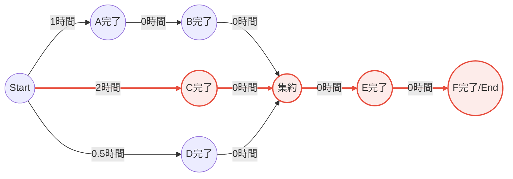

## 計画概要（背景の統合）

- 期限: 10/31までに
- 目的: 11/1に出前寿司を提供するプロジェクトを開始するための準備
- 成果物: 出前寿司セット提供に向けた計画（調達・調理の工程設計）
- 範囲: 計画書の作成（本ドキュメント）

本計画は、`task.csv` の作業分解に基づき、依存関係と所要時間を解析した上でPERT図（Mermaid, AOA）を生成し、クリティカルパスを明示します。所要時間が未記入のタスク（B, E, F）については、入力データに基づき図示上は0時間として扱います。

対象タスクと時間（時間）:
- A: 米炊き — 1
- B: 料理酢混ぜ合わせ — 0（入力未記載のため0扱い）
- C: 魚を捌く — 2
- D: 野菜、卵の加工 — 0.5
- E: 材料合わせ、パック詰め — 0（入力未記載のため0扱い）
- F: 個包装調味料添付 — 0（入力未記載のため0扱い）

依存関係:
- B は A 完了後
- E は B, C, D 完了後
- F は E 完了後

クリティカルパスの考察:
- E は B, C, D の完了を待つため、E の最早開始は max(A+B, C, D) = max(1, 2, 0.5) = 2
- プロジェクト全体の所要時間は 2 時間（C 経路が支配）
- クリティカルパス: C → E → F

## PERT図（Mermaid, AOA）

## 計画説明

- 本プロジェクトは11/1の提供開始を目標に、10/31までの準備完了をゴールに設定。
- 原材料の選定および加工タスクは `task.csv` を基礎とする。米炊き（A）後に料理酢混合（B）、魚の捌き（C）と野菜・卵加工（D）は並列実行可能。材料合わせ（E）はB, C, D全完了後、個包装調味料添付（F）で完了とする。
- クリティカルパスはC→E→Fであり、全体所要時間は2時間。Cの遅延が全体に直結するため、Cの人員配置・リスク対策（代替要員、予備時間の確保）が重要。
- B, E, F の所要時間は入力に存在せず、図示上は0時間で表現。実務計画では実測・見積りを反映し、再試算する。

